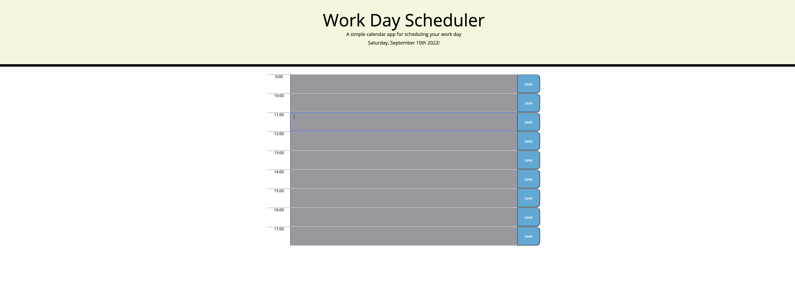

# Daily Planner

 ## Description
 For this project, For this project I created a daily planner that would allow the user to plan their daily task. Inside the application on the left side will display the times from 9am to 5pm, in the middle section will be a textblock that will allow the user to input their daily task, and on the far right will be a save button for the user to save their input to the local storage and retrieve that information when they load the application if they closed it. Some of the languages that I used in the application was JavaScript and CSS. The time blocks will display different colors depending on if the current hour has  past, was present, or the future of set hour timeblock. 

 ## Table of Content
 | [Installation](#installation) |
 [Usage](#usage) |
 [Credits](#credits) |
 [License](#license) |
 [Badges](#badges) |
 [Feature](#features) |
 [contributors](#contributors) |
 [test](#test) |

 ## Installation
 The steps to install the application are You'lll need to run this application on a live browser..

 ## Usage
 

 ## Credits
 [my Github](https://www.github.com/Grady253).
 [My email](mailto:grady.andre2@gmail.com).

 ## Instructions
 You'll need to click on the empty textbox and type user information then click the save button to store it.

 ## License
 
    This project is under N/A.
 

 ## Badges
 

 ## Test
 N/A
 ## Questions
 N/A
